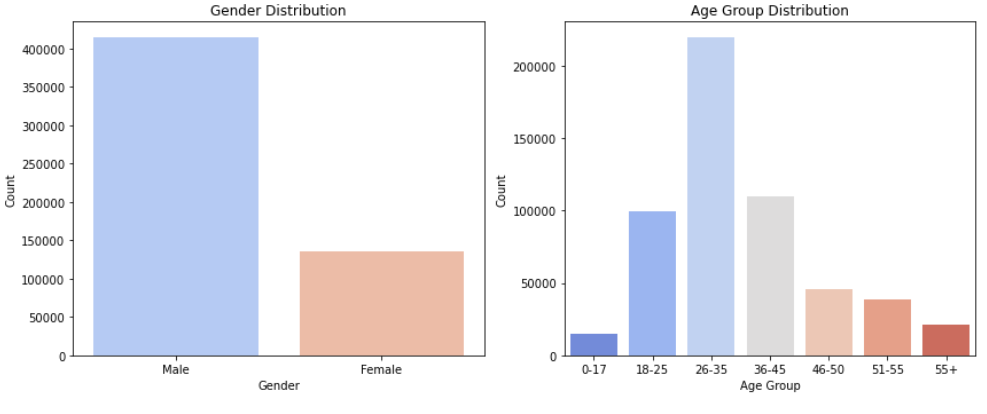
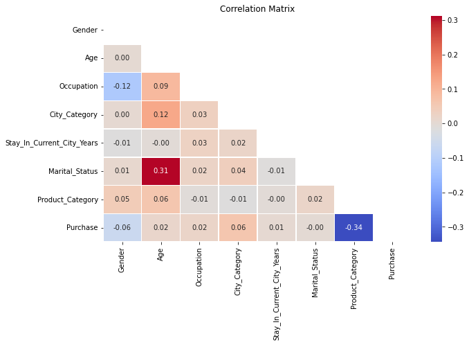
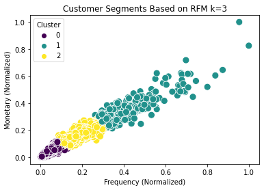

# Customer Segmentation using Machine Learning
Business problem: Walmart department store collects a transaction data (spending amount, purchase frequency), it treats customers the same. The company need to improve by understanding customer segmentation by purchasing behavior and personalize marketing strategies accordingly to reduce customer churn and deliver personalized marketing. 

## Methodology
Python (Pandas, Matplotlib, Seaborn, Scikit-Learn)\
RFM Analysis

### PreProcessing
Check for missing values\
Removing duplicate records\
Handling categorical values by encoding gender, age group and city into numerical form

## Results and Business Recommendation
### Exploratory Data Analysis(EDA)

More male customers contributed to the spending.
Majority of the customers come from the 26-35 age group.

### Correlation Matrix

A positive correlation of 0.31 shows that Age is moderately correlated to Marital_Status. This means that older peopel are likely to be married.

### RFM Analysis

By performing Customer Segmentation using Python, K-Means Custering, we transform raw data into actionable insights, businesses can use the findings to market to the right customers. Our analysis identifies 3 distinct shppint behaviors: 
Low value customers: rare shoppers with with low spending 
Moderate value customers: Moderate shopers with moderate spending 
High value customers: High value customers with high spending 
Recommendation: 
Re-engage low-value customers by introducing personalized discounts to encourage repeat purchases 
Entice more customers to buy more frequently by loyalty program 
Retain high value customers by offering them exclusive perks like early access to sales and free shipping to retain loyalty 

